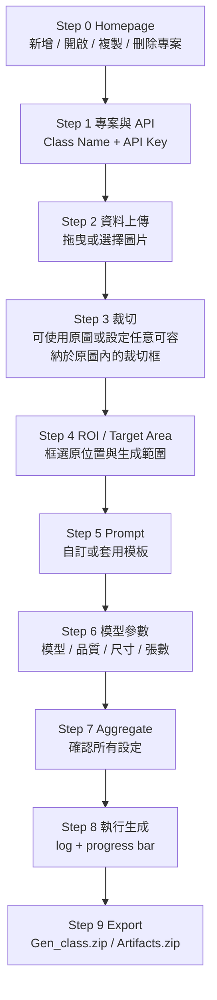

# GPT GenImage UI

`GPT GenImage UI` 是一個以 PySide6 製作的桌面介面，用來把 OpenAI GPT Image 生成/編輯流程包成可視化 Step-by-Step 工作流。此版本加入 **Step 0 專案管理**、圖片上傳、固定尺寸裁切、ROI / Target Area 框選、Prompt 模板與自訂 prompt、模型參數設定、Aggregate 確認、生成進度條，以及 Export / Artifacts 打包下載。

---

## 1. 安裝環境

建議使用虛擬環境。

### Windows

```bat
python -m venv venv
venv\Scripts\activate
python -m pip install --upgrade pip
pip install -r requirements.txt
```

### Linux / macOS

```bash
python -m venv venv
source venv/bin/activate
python -m pip install --upgrade pip
pip install -r requirements.txt
```

---

## 2. 啟動 UI

```bash
python launch_ui.py
```

或 Windows 可使用：

```bat
quick_start_ui_windows.bat
```

Linux / macOS 可使用：

```bash
bash quick_start_ui_linux.sh
```

---

## 3. 工作流程



---

## 4. 主要功能說明

### Step 0｜Homepage

- 新增專案
- 開啟既有專案
- 複製專案
- 刪除專案

每個專案會保存自己的設定狀態，方便重複開啟後繼續操作。

### Step 1｜專案與 API

- 設定 `Class Name`
- 輸入或替換 OpenAI API Key
- UI 只顯示 API Key 遮罩提示，不直接顯示完整 Key
- 若偵測到輸入的新 Key 與既有 Key 不同，會先詢問是否確認替換

### Step 2｜資料上傳

- 可拖曳單張、多張圖片
- 可拖曳整個圖片資料夾
- 可刪除已上傳圖片
- 點選圖片後會立即顯示預覽，不做逐步放大動畫

### Step 3｜裁切尺寸與圖像裁切

- 使用者先設定裁切框的寬與高
- 裁切寬高：只需大於 `0 px`，且不可超過目前選取原圖的寬高；生成輸出尺寸限制請於 Step 6 設定。
- 若超出範圍，輸入框會變紅，並提示修正
- 按下確認後，裁切框會跟隨滑鼠
- 在原圖上放開滑鼠後，即產生裁切完成圖

### Step 4｜ROI / Target Area

- 先列出 Step 3 的裁切完成圖
- 使用者可針對每張裁切圖框選：
  - `ROI`：原本要修補 / 移除的位置
  - `Target Area`：允許隨機生成的位置範圍
- 每張裁切圖會保存一份對應的位置資訊文字檔，供 Prompt 引用

### Step 5｜Prompt 編輯

- 預設為自訂 prompt
- 可切換使用模板
- 目前模板樣式：`瑕疵`
- 「實際傳送指令」會即時顯示真正寫入 prompt.txt 並送入 API 的內容
- 系統只保留必要的 ROI / Target Area 座標，避免多餘說明增加 token 消耗

### Step 6｜模型參數

- 支援：
  - `gpt-image-2`
  - `gpt-image-1.5`
  - `gpt-image-1`
  - `gpt-image-1-mini`
- 預設品質：`low`
- `gpt-image-2` 的生成輸出尺寸需符合 Step 6 所列限制，例如寬高需為 16 的倍數、長邊與總像素需在模型支援範圍內。
- 非 `gpt-image-2` 模型使用固定尺寸選項

### Step 7｜Aggregate

集中顯示前面所有設定，讓使用者確認後才正式生成。此頁面不顯示內部檔案路徑，避免造成閱讀負擔。

### Step 8｜執行生成

- 執行後端批次生成
- 顯示即時 log
- 顯示生成進度條；進度總數會依 Step 6 的「輸出張數」計算。

### Step 9｜Export / Artifacts

- `匯出 .zip`：可選擇本地資料夾，輸出 `Gen_<Class Name>.zip`；若未手動選擇，Submit 會輸出到專案預設 `exports` 資料夾。
- 左側會以直向縮圖清單顯示欲輸出的生成圖片，右側提供較大的預覽畫面。
- `回首頁`：返回 Step 0 專案管理，不清除目前專案資料。
- 會包含：
  - 生成圖片
  - COCO / YOLO 輸出資料
  - `log.txt`

---

## 5. 注意事項

- 正式生成會呼叫 OpenAI API，可能產生成本。
- API Key 會保存在本機 `.env`，分享專案前請確認不要外流。
- 若需開始新任務，請於 Step 9 點選 `回首頁` 回到 Step 0 後建立或開啟專案。


## v14 修正摘要

- 修正 Step 2 與其他預覽區選取圖片時，預覽畫面因 QLabel pixmap size hint 造成的逐漸放大問題。
- 預覽元件改為固定 layout size hint，圖片只在目前預覽框內即時縮放顯示，不再推動頁面高度變化。

## v15 更新摘要

- Step 5 Prompt 編輯改為「引用組別縮圖區」＋「輸入指令」＋「實際傳送指令」三段式版面。
- 引用組別改用縮圖顯示，可用滑鼠滾輪或水平捲軸瀏覽大量裁切圖。
- `實際傳送指令` 會自動合併使用者輸入 prompt、指定圖像、ROI 與 Target Area 資訊，不再需要額外按「顯示實際 prompt」。
- Step 0 Homepage 改為專案卡片樣式，Open / Duplicate / Remove 置於卡片右上角三點選單。
- 新增專案名稱唯一性檢查，避免專案名稱重複。
- Step 9 新增 `儲存專案`，只有儲存後才會出現在 Homepage 專案目錄。


## v16 更新摘要

- Step 6 已移除 `Dry run` 功能，模型參數頁只保留正式生成會用到的設定。
- 修正「輸出張數」傳遞邏輯：UI 的輸出張數現在代表整批任務的總生成張數，不再被裁切圖片數量放大。
- Step 7 Aggregate 顯示區已加高並改為可延展版面，方便一次檢視完整設定。


## v17 更新摘要

- Step 5 的「實際傳送指令」已精簡：移除 UI 說明文字、檔名、引用組別標籤與重複提示，只保留實際會影響生成的 prompt 與 ROI / Target Area 座標。
- 移除「ALL / 全部圖像位置資訊」卡片，避免一次把多張圖的位置資訊塞入同一份 prompt，造成 token 增加與指令混淆。
- `prompt.txt` 會寫入精簡後的實際傳送指令；後端會讀取該檔案作為 OpenAI Image API 的文字 prompt。

## v18 更新摘要

- Step 5 已恢復 `ALL / 全部圖像位置資訊` 卡片。
- 選擇 ALL 時，實際傳送指令會合併所有已完成 ROI / Target Area 的裁切圖位置資訊。
- ALL 模式仍採精簡格式，只保留每張圖的識別名稱、ROI 與 Target Area 座標，避免加入多餘說明文字。

## v19 更新摘要

- Step 0 Homepage 的專案卡片重新排版，卡片上方會保留使用者建立專案時輸入的大小寫，不再強制轉大寫；卡片明細新增 Create / Updated 資訊，且不再重複顯示專案名稱。
- Projects 區塊高度與卡片尺寸已調整，避免專案卡片被擠壓在同一小區域。
- Export / Artifacts 打包改為只保留使用者真正需要的輸出資料：`yolo/`、`coco/` 與 `log.txt`。不再把 mask、ROI、target area、project_state、manifest 或其他中間產物一起放入 Artifacts。

## v20 update
- Homepage project-card menu actions were hardened: Open, Duplicate, and Remove now use explicit QAction slots.
- Duplicate now creates an automatic unique copy such as `<project>_copy` without showing the new-project dialog, and it also copies the class-scoped workspace so the duplicated project can be opened and continued independently.
- Remove still asks for confirmation before deleting the selected saved project and its class-scoped workspace.

## v21 更新摘要

- Export 與 Artifacts 壓縮檔內改為外層包含 `<class_name>/`，避免解壓縮後 `yolo/`、`coco/`、`log.txt` 直接散在目標資料夾。
- 修正「最新 run」匯出只抓到單一 child run 的問題；UI 生成時會以同一個 run name 將多個裁切圖的 child runs 分組，Export 會匯出整批分組結果，並以模型參數中的輸出張數作為最大匯出張數。
- `runs/` 中預設只保留最終生成圖片、`metadata.json`、`prompt_used.txt` 與 `log.txt`；mask、ROI preview、target area preview、API response JSON 等中間產物會在生成結束後自動清除，以降低磁碟使用量。
- Step 9 預覽清單改為依照 `metadata.json` 中的 final outputs 顯示，避免把 mask、target area 或其他中間圖片列進輸出清單。

## v22 更新摘要

- Step 9 移除容易混淆的 `只匯出最新 run` 與 `複製生成圖片到 export/images` 勾選框。
- 改為更直覺的 `匯出範圍` 選單：
  - `目前 run（依 Run name）`：只匯出目前 Step 6 設定的 run name，例如 `test_002`。
  - `全部 runs（包含歷次 runs）`：匯出同一 class 下所有歷次 run，例如同時包含 `test_001` 與 `test_002`。
- `複製生成圖片到 export/images` 已改為內部固定流程，不再顯示給使用者；最終 Artifacts 仍會依勾選格式輸出乾淨的 `yolo/`、`coco/` 與 `log.txt`。

## v23 更新摘要

- Step 2 已強化拖曳上傳：可直接把圖片檔或圖片資料夾拖到 Step 2 頁面任意位置，不再只限清單或預覽框。
- 拖曳事件已在主視窗、頁面捲動區與 Step 2 內部元件做統一接收，避免 QScrollArea 或空白區域攔截拖曳事件造成無反應。
- 支援單張、多張圖片與整個資料夾拖曳，上傳後會自動刷新清單與預覽。

## v24 更新摘要

- Step 2 拖曳上傳再次強化：拖曳進入時會強制使用 CopyAction 接收外部圖片或資料夾，降低 Windows 顯示禁止游標的情況。
- `選擇圖片資料夾` 改為非原生、非模態的資料夾選擇視窗，避免開啟資料夾選擇視窗時主 UI 被鎖定，導致拖曳到主畫面一定顯示禁止符號。
- Step 2 提示文字已補充：可從 Windows 檔案總管或桌面直接拖曳圖片檔 / 圖片資料夾到清單或預覽區，也可使用按鈕選擇資料夾。

## v25 更新摘要

- 專案管理改為 `project/<專案名稱>/` 結構，專案名稱不再自動加時間戳，且必須唯一。
- Step 3 裁切流程新增「刪除選取裁切圖」，並將每張裁切圖的來源檔名、裁切座標、中心點與裁切尺寸記錄到專案設定中。
- Step 4 ROI / Target Area 支援多個 ROI 框、Target Area 框選、Ctrl + 滑鼠滾輪縮放，以及十字游標操作提示。
- Step 6 新增「確認參數並估算本次成本」按鈕，會在生成前顯示預估 USD 成本。
- Step 8 生成完成後會嘗試統計 API 回傳 usage 中的實際估算成本，並存入專案摘要。
- Step 9 移除額外的 Artifacts / 儲存專案按鈕；專案會自動保存，Export zip 改為可選功能，使用者可自行指定輸出位置。

## v26 update notes

- Step 3：裁切完成縮圖可回載到中間原圖預覽；會顯示原始裁切框、尺寸標籤，並同步更新裁切框寬高。右鍵點擊既有紅色裁切框可啟用重編輯，之後拖曳框線可重新裁切並輸出新裁切圖。
- Step 4：裁切圖縮圖改為直向清單，滑鼠滾輪可逐張切換；ROI / Target Area 框選區放大，支援 Ctrl + 滾輪縮放與滑鼠中鍵平移。
- Step 4：ROI 支援多框，新增「選取 ROI」、「刪除全部 ROI」、「刪除選取 ROI」按鈕，刪除後會同步更新座標與 mask。
