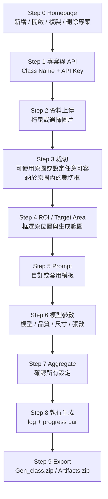

# GPT GenImage UI

`GPT GenImage UI` 是一個以 PySide6 製作的桌面介面，用來把 OpenAI GPT Image 生成/編輯流程包成可視化 Step-by-Step 工作流。此版本加入 **Step 0 專案管理**、圖片上傳、固定尺寸裁切、ROI / Target Area 框選、Prompt 模板與自訂 prompt、模型參數設定、Aggregate 確認、生成進度條，以及 Export / Artifacts 打包下載。

---

## 1. 安裝環境

建議使用虛擬環境。

### Windows

```bat
python -m venv venv
venv\Scripts\activate
python -m pip install --upgrade pip
pip install -r requirements.txt
```

### Linux / macOS

```bash
python -m venv venv
source venv/bin/activate
python -m pip install --upgrade pip
pip install -r requirements.txt
```

---

## 2. 啟動 UI

```bash
python launch_ui.py
```

或 Windows 可使用：

```bat
quick_start_ui_windows.bat
```

Linux / macOS 可使用：

```bash
bash quick_start_ui_linux.sh
```

---

## 3. 工作流程



---

## 4. 主要功能說明

### Step 0｜Homepage

- 新增專案
- 開啟既有專案
- 複製專案
- 刪除專案

每個專案會保存自己的設定狀態，方便重複開啟後繼續操作。

### Step 1｜專案與 API

- 設定 `Class Name`
- 輸入或替換 OpenAI API Key
- UI 只顯示 API Key 遮罩提示，不直接顯示完整 Key
- 若偵測到輸入的新 Key 與既有 Key 不同，會先詢問是否確認替換

### Step 2｜資料上傳

- 可拖曳單張、多張圖片
- 可拖曳整個圖片資料夾
- 可刪除已上傳圖片
- 點選圖片後會立即顯示預覽，不做逐步放大動畫

### Step 3｜裁切尺寸與圖像裁切

- 使用者先設定裁切框的寬與高
- 裁切寬高：只需大於 `0 px`，且不可超過目前選取原圖的寬高；生成輸出尺寸限制請於 Step 6 設定。
- 若超出範圍，輸入框會變紅，並提示修正
- 按下確認後，裁切框會跟隨滑鼠
- 在原圖上放開滑鼠後，即產生裁切完成圖

### Step 4｜ROI / Target Area

- 先列出 Step 3 的裁切完成圖
- 使用者可針對每張裁切圖框選：
  - `ROI`：原本要修補 / 移除的位置
  - `Target Area`：允許隨機生成的位置範圍
- 每張裁切圖會保存一份對應的位置資訊文字檔，供 Prompt 引用

### Step 5｜Prompt 編輯

- 預設為自訂 prompt
- 可切換使用模板
- 目前模板樣式：`瑕疵`
- 「實際傳送指令」會即時顯示真正寫入 prompt.txt 並送入 API 的內容
- 系統只保留必要的 ROI / Target Area 座標，避免多餘說明增加 token 消耗

### Step 6｜模型參數

- 支援：
  - `gpt-image-2`
  - `gpt-image-1.5`
  - `gpt-image-1`
  - `gpt-image-1-mini`
- 預設品質：`low`
- `gpt-image-2` 的生成輸出尺寸需符合 Step 6 所列限制，例如寬高需為 16 的倍數、長邊與總像素需在模型支援範圍內。
- 非 `gpt-image-2` 模型使用固定尺寸選項

### Step 7｜Aggregate

集中顯示前面所有設定，讓使用者確認後才正式生成。此頁面不顯示內部檔案路徑，避免造成閱讀負擔。

### Step 8｜執行生成

- 執行後端批次生成
- 顯示即時 log
- 顯示生成進度條；進度總數會依 Step 6 的「輸出張數」計算。

### Step 9｜Export / Artifacts

- `匯出 .zip`：可選擇本地資料夾，輸出 `Gen_<Class Name>.zip`；若未手動選擇，Submit 會輸出到專案預設 `exports` 資料夾。
- 左側會以直向縮圖清單顯示欲輸出的生成圖片，右側提供較大的預覽畫面。
- `回首頁`：返回 Step 0 專案管理，不清除目前專案資料。
- 會包含：
  - 生成圖片
  - COCO / YOLO 輸出資料
  - `log.txt`

---

## 5. 注意事項

- 正式生成會呼叫 OpenAI API，可能產生成本。
- API Key 會保存在本機 `.env`，分享專案前請確認不要外流。
- 若需開始新任務，請於 Step 9 點選 `回首頁` 回到 Step 0 後建立或開啟專案。


